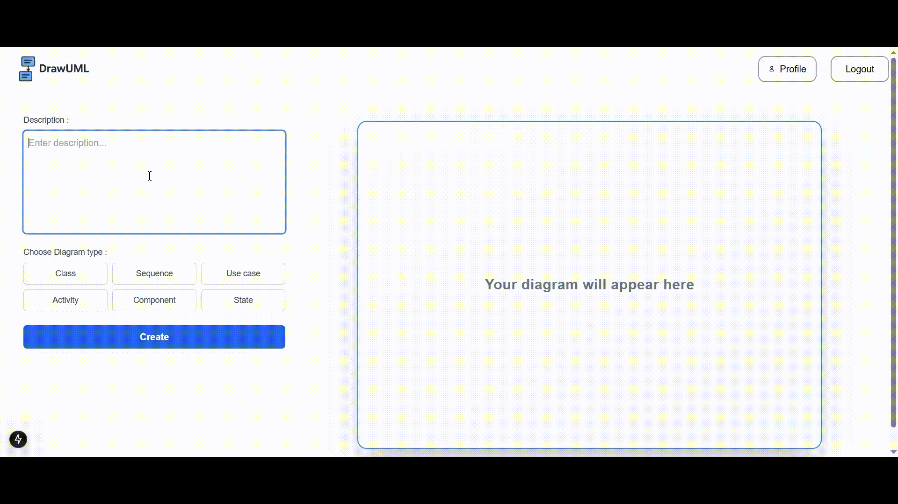

# DrawUml

**DrawUml** is an AI-powered UML generation tool that creates class, sequence, and other UML diagrams from natural language descriptions. It offers secure authentication, personalized user profiles, and diagram generation using DeepSeek R1 API.

---

## 🔐 Secure Authentication

- Uses **JWT (JSON Web Tokens)** for secure user authentication and session management.

---

## ✨ Key Features

- 🧠 **AI-Powered UML Generation**  
  Generate UML diagrams based on text descriptions and selected diagram type.

- 👤 **User Profile Management**  
  Update profile details, view generation history, and delete your account anytime.

- 🧾 **Generation History**  
  View and manage previously generated UML diagrams.

- 🔐 **Secure Access**  
  Authenticated access via JWT ensures user data is protected.

---

## ⚙️ Tech Stack

| Technology          | Purpose                           |
| ------------------- | --------------------------------- |
| **NestJS**          | Backend API and authentication    |
| **React**           | Frontend UI components            |
| **Next.js**         | Server-side rendering and routing |
| **Tailwind CSS**    | Modern utility-first styling      |
| **JWT**             | Secure authentication             |
| **DeepSeek R1 API** | AI-powered text-to-UML generation |
